# ヴィーガン向け体調管理アプリ

## MTI Summer Internship優勝プロダクト🏆

株式会社MTI Summer Internshipで開発したWebアプリ.<br>３日間で, 4人で製品企画（マーケティング）から設計・実装までを行なった. <br> 自分はバックエンド開発の設計から実装を行なった.

## 目次
  - [目次](#目次)
  - [設計](#設計)
    - [技術スタックの構成図](#技術スタックの構成図)
      - [AWS環境](#AWS環境) 
    - [テーブル図](#テーブル図)
      - [Userテーブル](#userテーブル)
      - [Articleテーブル](#articleテーブル)
      - [nutrients(テーブルではない)](#nutrientsテーブルではない)
      - [Dishesテーブル](#dishesテーブル)
      - [DailyMealsテーブル](#dailymealsテーブル)
      - [Ingredientsテーブル](#ingredientsテーブル)
    - [Web REST API 設計](#web-rest-api-設計)
      - [Userテーブルに関するAPI](#userテーブルに関するapi)
      - [Articleテーブルに関するAPI](#articleテーブルに関するapi)
      - [Dishesテーブルに関するAPI](#dishesテーブルに関するapi)
      - [DailyMealsTableに関するAPI](#dailymealstableに関するapi)
      - [IngredientsTableに関するAPI](#ingredientstableに関するapi)
    - [API動作例](#api動作例)
      - [User関連](#user関連)
        - [POST `/user/signup`](#post-usersignup)
        - [GET `/user`](#get-user)
      - [Article関連](#article関連)
        - [POST `/article`](#post-article)
        - [GET `/articles`](#get-articles)
      - [dishes関連](#dishes関連)
        - [POST `/dishes`](#post-dishes)
        - [GET `/dishes`](#get-dishes)
      - [dailyMeals関連](#dailymeals関連)
        - [POST `/daily-meals`](#post-daily-meals)
        - [PUT `/daily-meals`](#put-daily-meals)
        - [GET `/daily-meals`](#get-daily-meals)
        - [GET `daily-meals/total`](#get-daily-mealstotal)
      - [ingredients関連](#ingredients関連)
        - [GET `/ingredients`](#get-ingredients)

## 設計

### 技術スタックの構成図


#### AWS環境
- S3
  - Buildした静的コンテンツをデプロイ環境として利用.
- Lambda
  - イベントドリブンでコードを実行する.
  - API Gatewayと組み合わせるとWeb APIとして機能できる.
- API Gateway
  - APIのエンドポイント. リクエストをLambdaへ捌く. 
- Dynamo DB
  - NoSQLのデータベース. Key-Value方式でデータを保存. 
- Cloud Watch
  - APIのログを確認する. 

### テーブル図

```mermaid
classDiagram
    User -- DailyMeals : 1 - n (ユーザーは多数の食事記録を持つ)
    User -- Article : 1 - n (ユーザーは多数の投稿を持つ)
    User -- Dishes : 1 - n (ユーザーは多数の料理を持つ)
    Ingredients -- Dishes : 1 - n (1つの原材料は多数の料理に使われる)
    DailyMeals -- Dishes : 1 - n (1つの食事記録は多数の料理から成る)

    class User {
        +userId (PK)
        password
        salt
        age
        sex
        height
　　　　　　　　　　　　　　　　weight
        dailyNutrientGoals
    }

    class Article {
       +userId(PK)
       +timestamp(SK)
       category
       text
    }

    class Dishes {
        +dishName (PK)
        +userId (SK)
        ingredients
        nutrients
    }

    class DailyMeals {
        +userId (PK)
        +date (SK)
        meals 
    }

    class Ingredients {
        +ingredientName (PK)
        nutrients
    }

```


---

#### Userテーブル
dailyNutirientsGoalsはバックエンド側で計算して返す.

| カラム名  | 説明       |
|---------|-----------|
| userId  | ユーザーID (パーティションキー) |
| password | ハッシュ化したパスワード   |
| salt | ソルト |
| age     | 年齢       |
| sex | 性別 |
| height     | 身長 |
| weight     | 体重 |
| dailyNutrientGoals | 1日に取るべき栄養素の目標値(map) 例:{"protein":300, "dhc":100} |

----
#### Articleテーブル

| カラム名  | 説明       |
|---------|-----------|
| userId  | ユーザーID (パーティションキー) |
| timestamp | 投稿日時 (ソートキー)   |
| category     | 投稿のタグ. オプション.     |
| text | 記事の内容. |

---
#### nutrients(テーブルではない)
マップ形式で返される各栄養素の名前.

| 栄養素名 | 単位 |
|---|---|
| protein | g |
| vitamineD | μg |
| vitamineD12 | μg |
| iron | mg |
| dha | g |
| epa | g |
| calcium | mg |
| zinc | mg |

---

#### Dishesテーブル
ユーザーが入力orデフォルトである料理を保存. ユーザーが新たな料理を追加したりすることが可能. 

| カラム名       | 説明                                               |
|--------------|--------------------------------------------------|
| dishName       | 料理の名前 (パーティションキー)                               |
| userId       | ユーザーID (ソートキー)                                   |
| ingredients  | 原材料をマップ形式で重量と保存. [{"name": "tomato", "weight":100}, ]                          |
| nutrients    | 原材料から計算された栄養成分情報 {"vitamine":100, "protein": 200}                             |

---

#### DailyMealsテーブル
各ユーザーがその日に何を食べたのか、そしてその日の合計栄養摂取量を保存

| カラム名     | 説明                               |
|------------|----------------------------------|
| userId     | ユーザーのID (パーティションキー)          |
| date   | 食事の日 (ソートキー)                  |
| meals   | 朝食、昼食、夕食ごとにdishes, totalNutrientsを管理する.                  |

```
//mealsの例
{
  "userId": "user1",
  "date": 20230824,
  "meals": {
    "breakfast": {
      "dishes": [{"dishName":"パスタ", "quantity":1}, {"dishName":"サラダ", "quantity":3}],
      "nutrients": {"vitamineD":10, "calcium":10,,,,}
    },
    "lunch": {
       "dishes": [],
       "nutriens": {}
     },
    "dinner": {...}
  }
}
```

---

#### Ingredientsテーブル
原材料の栄養を保存. dishesの料理の栄養計算に利用される. 

| カラム名        | 説明                               |
|---------------|----------------------------------|
| ingredientName| 原材料の名前(パーティションキー)                 　|
| nutrients     | 原材料の栄養成分情報                          |

---


### Web REST API 設計

#### Userテーブルに関するAPI
| 操作   | Method | 処理の内容 | Endpoint           | リクエストパラメータ                            | レスポンス内容                  |
|--------|----|----|--------------------|-----------------------------------------------|------------------------------|
| 登録   | POST   | 新しいユーザーを登録. | `/user/signup`          | userId, password, age, sex, weight, height                 | success/error, dailyNutrientGoals, token        |
| 取得   | GET    | ユーザー情報を取得する. | `/user？userId` | userId                                             | 各種User情報（例を参照） |
| 削除   | DELETE | ユーザー削除. | `/user?userId` | userId                                             | success/error |
| 変更 | PUT | ユーザー情報を変更. | `/user?userId` | userId | succes/error, dailyNutrientGoals |
| ログイン | POST | ユーザーのログイン. | `/user/login` | userId, password | success/error, token |

#### Articleテーブルに関するAPI

| 操作   | Method | 処理の内容 | Endpoint           | リクエストパラメータ         | レスポンス内容                  |
|--------|----|----|--------------------|-----------------------------------------------|------------------------------|
| 投稿 | POST | 新しい記事の投稿. | `/article` | userId, text, category | success/error, timestamp |
| 削除 | DELETE | 記事の削除. | `/article?userId&timestamp` | userId, timestamp | success/error |
| 取得　|　GET　| 条件に応じて記事の一覧を取得する. | `/articles` | userId, (start, end, category) | articleのリスト |

#### Dishesテーブルに関するAPI

| 操作   | Method | 処理の内容 | Endpoint           | リクエストパラメータ                            | レスポンス内容                  |
|--------|----|----|--------------------|-----------------------------------------------|------------------------------|
| 登録   | POST   | 新しい料理を追加. | `/dishes`          | userId, dishName, ingredients                 | success/error, dishName        |
| 取得   | GET    | ユーザーがすでに登録した料理の一覧を表示. | `/dishes？userId` | userId                                             | List<dishName> |
| 削除   | DELETE | ユーザーがすでに登録した料理を削除. | `/dishes?dishName&userId` | dishName, userId                                             | success/error                  |

#### DailyMealsTableに関するAPI

| 操作   | Method | 処理の内容 | Endpoint                      | リクエストパラメータ               | レスポンス内容              |
|--------|-------|--|-------------------------------|----------------------------------|--------------------------|
| 登録   | POST   |  朝・昼・夜の食事を料理から選択し投稿. | `/daily-meals`                | UserId, Date, MealType, Dishes   | success/error, TotalNutrients |
| 変更   | PUT   |  一度,保存した食事内容を変更. | `/daily-meals`                | UserId, Date, MealType, Dishes   | success/error, TotalNutrients |
| 取得   | GET   |  その日の指定した食事の情報を取得. | `/daily-meals?userId&date?mealType`                | userId, date, mealType  | success/error, dishes, nutrients |
| 取得   | GET   |  その日の摂取した栄養素の合計取得. | `/daily-meals/total?userId&date`                | userId, date,   | success/error, TotalNutrients |

#### IngredientsTableに関するAPI

| 操作   | Method | 処理の内容 | Endpoint                      | リクエストパラメータ               | レスポンス内容              |
|--------|------|--|-------------------------------|----------------------------------|--------------------------|
| 取得   | GET   | 料理新規追加時に一覧を表示 |  `/ingredients`                |   | success/error, list<ingredientName> |
| 登録 | POST | 新たな原材料を追加 | `/ingredients` | ingredientName, nutrients | success/error |


### API動作例
#### User関連
##### POST `/user/signup`
```
//リクエスト
{
    "userId": "nick",
    "password": "password",
    "sex": "male",
    "age": 66,
    "height": 180,
    "weight": 70
}
```
```
// response
{
    "userId": "nick",
    "sex": "male",
    "age": 66,
    "height": 180,
    "dailyNutrientGoals": {
        "protein": 84,
        "vitaminD": 8.5,
        "vitaminB12": 2.4,
        "iron": 8,
        "dha": 11,
        "epa": 2,
        "calcium": 800,
        "zinc": 11
    },
    "token": "mtiToken"
}
```

##### GET `/user`
```
// GET /user?userId ユーザーIDを指定してユーザー情報を取得.
{
    "userId": "nick",
    "height": 180,
    "sex": "male",
    "weight": 70,
    "age": 66,
    "dailyNutrientGoals": {
        "calcium": 800,
        "protein": 84,
        "vitaminD": 8.5,
        "epa": 2,
        "iron": 8,
        "vitaminB12": 2.4,
        "dha": 11,
        "zinc": 11
    },
}
```
----
#### Article関連
##### POST `/article`
```
//request
{
    "userId": "team3",
    "text": "豆乳高い....",
    "category": "sad"
}
```
```
//respone
{
    "userId": "team3",
    "text": "豆乳高い....",
    "category": "sad",
    "timestamp": 1692937080043
}
```

##### GET `/articles`
```
//userIdを指定. 必要に応じてカテゴリーや日時の絞り込みパラメータをつける.
{
    "articles": [
        {
            "category": "sad",
            "text": "豆乳高い....",
            "userId": "team3",
            "timestamp": 1692937080043
        },
        {
            "category": "good",
            "text": "豆腐ハンバーグ美味しかった.",
            "userId": "team3",
            "timestamp": 1692935683063
        }
    ]
}
```

----

#### dishes関連
##### POST `/dishes`
```
// リクエストボディ
{
    "dishName": "チキントマト",
    "userId": "team3",
    "ingredients": [
        { "name":"tomato", "weight":100 },
        { "name":"chicken", "weight":100 }
    ]
}
```
```
// レスポンスボディ
{
    "dishName": "チキントマト",
    "userId": "team3",
    "ingredients": [
        { "name": "tomato", "weight": 100},
        { "name": "chicken", "weight": 100}
    ],
    "nutrients": {
        "vitamineD": 12,
        "calcium": 60,
        "protein": 10,
        "epa": 1,
        "iron": 13,
        "dha": 1,
        "vitamineD12": 25,
        "zinc": 20
    }
}
```

##### GET `/dishes`
```
// /dishes?userId=team3
// レスポンスはdishNameがリストになって返ってくる.
{
    "dishes": [
        "塩オニオン",
        "オニオンサラダ"
    ]
}
```
----
#### dailyMeals関連
##### POST `/daily-meals`
```
// request
{
    "userId": "team3",
    "date": 20230824,
    "dishes": [
        { "dishName":"チキントマト", "quantity":1 },
        { "dishName":"オニオンサラダ", "quantity":2 }
    ],
    "mealType": "dinner"
}
```
```
// response
{
    "nutrients": {
        "vitamineD": 12.37,
        "calcium": 80,
        "protein": 10,
        "epa": 1,
        "iron": 13,
        "dha": 1,
        "vitamineD12": 25,
        "zinc": 20
    }
}
```

##### PUT `/daily-meals`
優先度低め. ユーザーは食べた食事の料理を変更できる. 
```
// 料理の変更のrequest
{
    "userId": "team3",
    "date": 20230824,
    "dishes": [
        { "dishName":"チキントマト", "quantity":1 },
        { "dishName":"オニオンサラダ", "quantity":1 }
    ],
    "mealType": "dinner"
}
```
```
// response
{
    "nutrients": {
        "vitamineD": 12.185,
        "calcium": 70,
        "protein": 10,
        "epa": 1,
        "iron": 13,
        "dha": 1,
        "vitamineD12": 25,
        "zinc": 20
    }
}
```

##### GET `/daily-meals`
```
//userIdとdate, mealTypeを投げて,response
{
    "userId": "team3",
    "date": 20230824,
    "dishes": [
        {
            "dishName": "チキントマト",
            "quantity": 1
        },
        {
            "dishName": "オニオンサラダ",
            "quantity": 2
        }
    ],
    "nutrients": {
        "vitamineD": 12.37,
        "calcium": 80,
        "protein": 10,
        "epa": 1,
        "iron": 13,
        "dha": 1,
        "vitamineD12": 25,
        "zinc": 20
    }
}
```

##### GET `daily-meals/total`
```
//userIdとdateを渡すとその日の合計摂取栄養値が返ってくる.
{
    "totalNutrients": {
        "vitamineD": 37.11,
        "calcium": 240,
        "protein": 30,
        "epa": 3,
        "iron": 39,
        "dha": 3,
        "vitamineD12": 75,
        "zinc": 60
    }
}
```

----
#### ingredients関連
##### GET `/ingredients`
```
// ingredientsのName一覧がリストで返ってくる
{
    "ingredients": [
        "onion",
        "chicken",
        "lettuce",
        "salt",
        "tomato"
    ]
}
```

